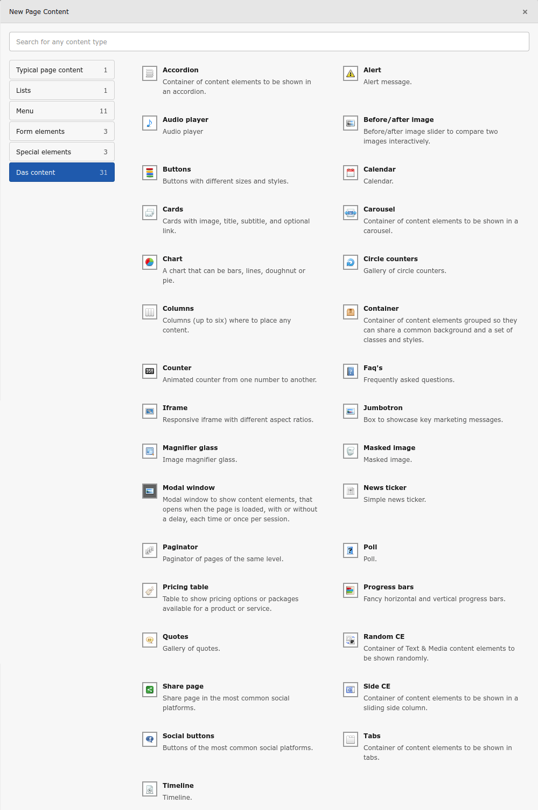

.. _das-content-elements:

Das content elements
====================

**Das** comes with a set of ready to use content elements, which cover a wide range of options: Accordion, Alert, Audio player, Before/after image, Buttons, Calendar, Cards, Carousel, Chart, Circle counters, Columns, Container, Counter, Faq's, Iframe, Jumbotron, Magnifier glass, Masked image, Modal window, News ticker, Paginator, Poll, Pricing table, Progress bars, Quotes, Random CE, Share page, Side CE, Social buttons, Tabs, and Timeline.

The configuration of each content is in the tab :guilabel:`Configuration`. The names of the fields are self-explanatory.

For more information on these new content elements, visit `Das Content elements <https://das.jaumepresas.com/content-elements/das-content-elements>`_.
