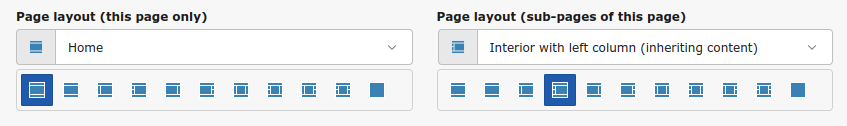
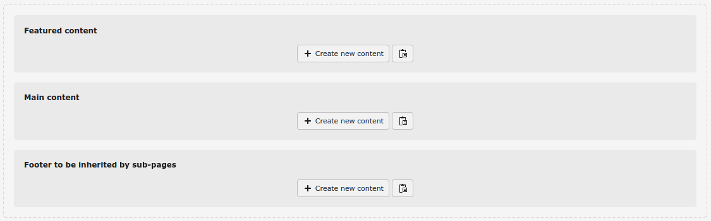
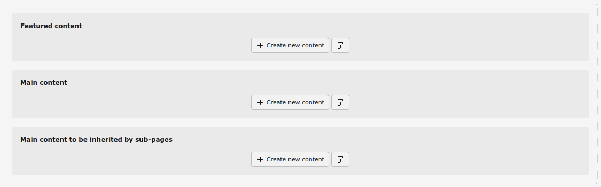
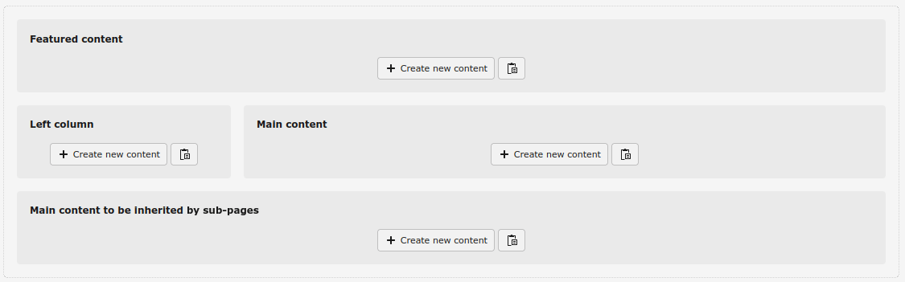
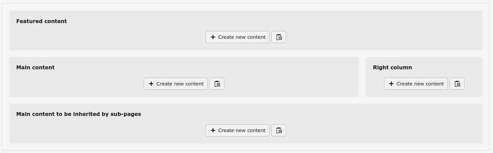
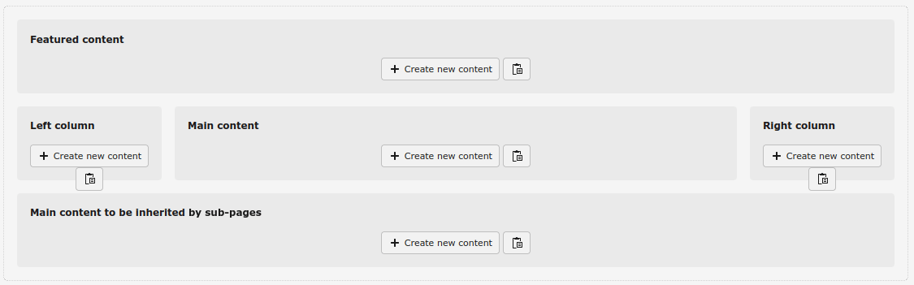

.. _page-layouts:

Page layouts
============

**Das** comes with a set of page layouts that cover any possible scenario:

* Home

* Interior

* Interior with left column

* Interior with left column (inheriting content)

* Interior with right column

* Interior with right column (inheriting content)

* Interior with left and right columns

* Interior with left and right columns (only left inheriting content)

* Interior with left and right columns (only right inheriting content)

* Interior with left and right columns (both inheriting content)

* Only content (without header and footer)

..  _content-areas:

Content areas
-------------

The available content areas depend on each page layout.

* **Home**: With *Featured content*, *Main content* and *Footer to be inherited by sub-pages*

* **Interior**: With *Featured content*, *Main content* and *Main content to be inherited by sub-pages*

* **Interior with left or/and right column**: With *Featured content*, *Left or/and Right column*, *Main content* and *Main content to be inherited by sub-pages*. There are variants to slide the content from the left and right columns, so if a page doesn't have any content on the column/s TYPO3 climbs the page tree until it finds a page with content in the column/s and renders it

* **Only content**: With *Featured content*, *Main content* and *Main to be inherited by sub-pages*, that will be rendered without header, navigation bar, breadcrumb and footer

These are the content areas:

* **Featured content**: the one immediately under the navigation bar (before or after the breadcrumb). It's meant for some highlight content (carousel, banner…), usually full width

* **Main content**: for the main content of the page

* **Main content to be inherited by sub-pages**: for the main content to be inherited by its sub-pages

* **Left/Right column**: for the content to be shown in the left and right columns, which can be inherited by sub-pages

* **Footer** (only in the Home layout): for the content to fill the footer of the page, inherited by all sub-pages
