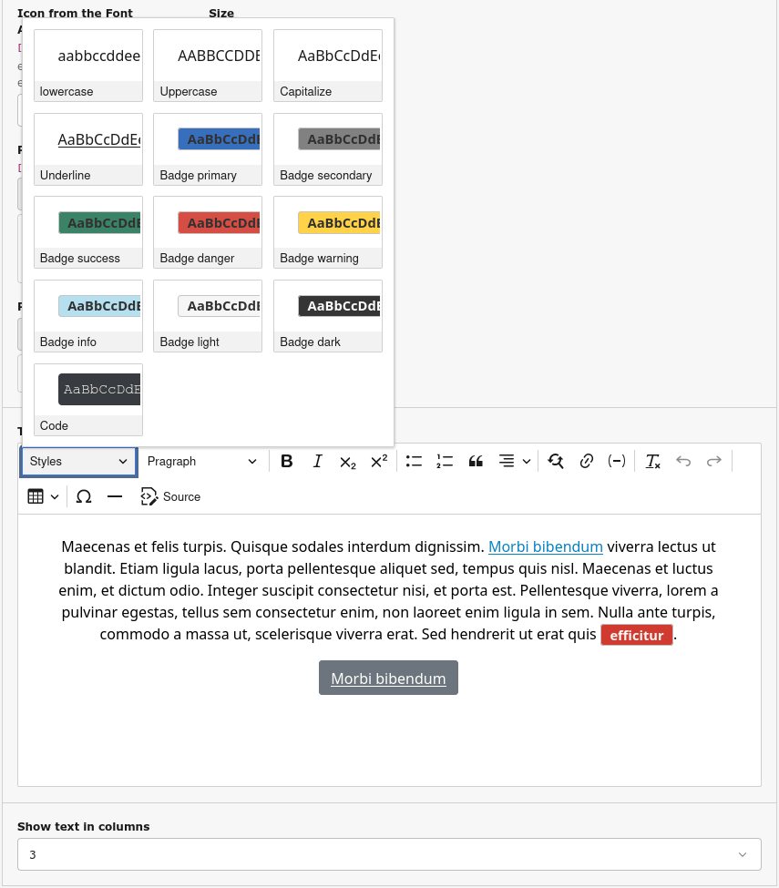

.. _rte:

RTE
===

The RTE is customized so Bootstrap classes can be applied to text, links, buttons, badges, and tables.

For the **Text & Media** content element an additional field *Show text in columns* has been added, so the text in the frontend can be shown in up to four columns.

Also for the **Text & Media** content element the string “#YEAR#” in the bodytext will be automatically replaced in the frontend by the current year.

