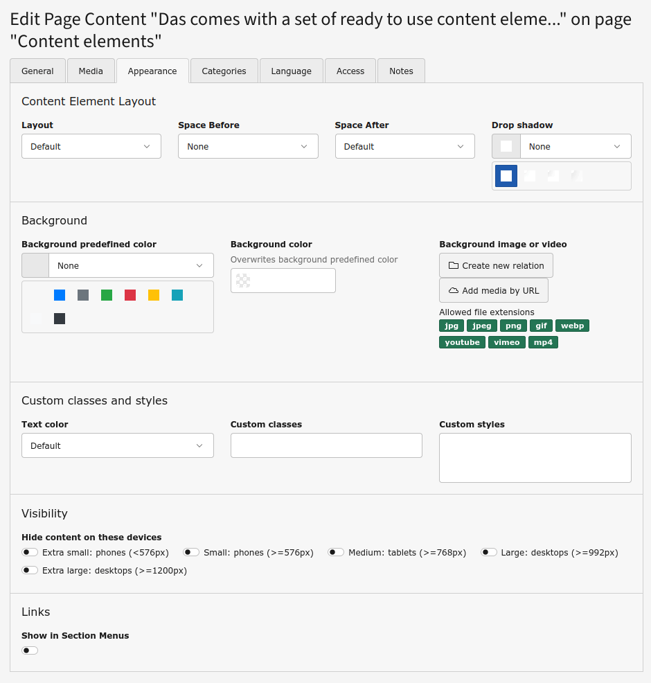
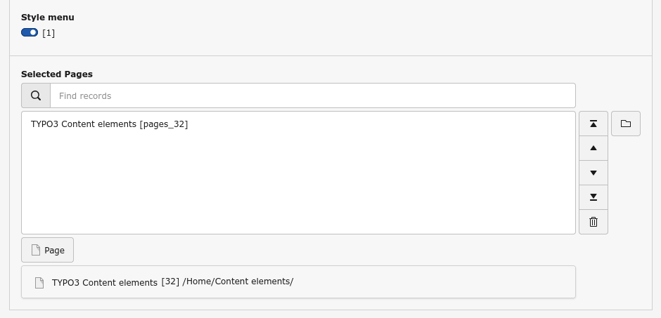
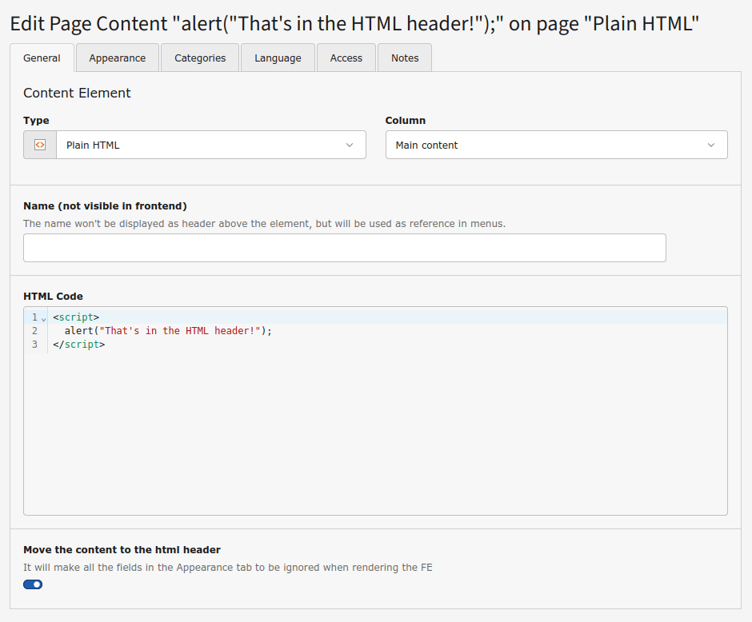
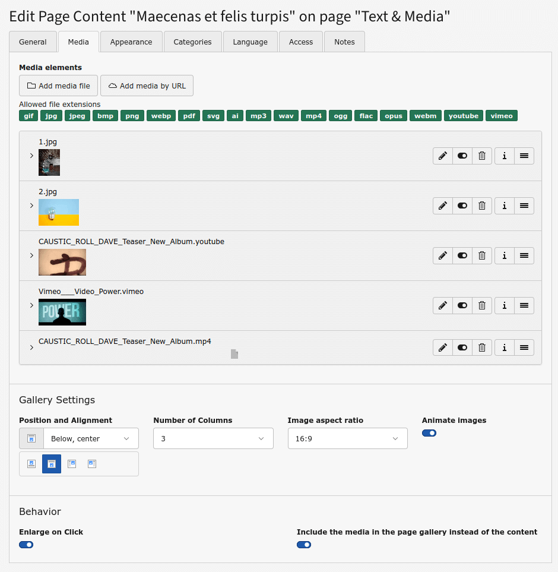

.. _typo3-content-elements:

TYPO3 content elements
======================

Templates and partials of these TYPO3 content elements and plug-ins: File links, Form, Indexed search, Login, Menus, Plain HTML, and Text & Media have been adapted for Bootstrap.

Content elements have been enhanced with some extra fields.

The *Headlines* palette has now some extra fields to add a Font Awesome icon to the header, allowing to choose its size, position and color.

The :guilabel:`Appearance` tab has now some extra fields and new predefined options for the field Layout:

* *Layout*: the new options allow to choose the width of the content, which can go from 50% of the default width to 100% of the viewport

* *Drop shadow*: to add a drop shadow around the content, with different intensities

* *Background*: this new palette allows to add a background to the content. It can be a predefined or custom color, and an image or a video. If an image or video, it can be blurred or have a vignette, to make the text more readable

* *Custom classes and styles*: this new palette allows to force the text to be black or white regardless the styles (useful when setting a background) and add classes and custom inline styles to be applied to the content

* *Visibility*: this new palette allows to set the visibility of the content for each break point

If not needed, the new fields can be disabled via TSConfig.

..  _menus:

Menus
------

All the **Menu** content elements have an extra field *Style menu* to render the menus as Bootstrap unordered list groups instead of plain lists.

..  _plain-html:

Plain HTML
----------

The **Plain HTML** content element has been enhanced with a new field, *Move the content to the html header*, which allows the content to be rendered in the html header instead of the body.

..  _text-and-media:

Text & Media
------------

The **Text & Media** content element has been enhanced to handle properly images and video galleries, making them fully responsive. It's possible to select the width of the gallery when beside text and the aspect ratio of the thumbnails, so all thumbnails are shown in a consistent grid. YouTube and Vimeo thumbnails are retrieved from their servers and stored locally, so no user information is sent to their servers.

The palette *Behavior* in the :guilabel:`Media` tab has a new field, *Include the media in the page gallery instead of the content*, to force the media of the content element to be part of a global page gallery if enlarged.

The string “#YEAR#” in the bodytext will be automatically replaced in the frontend by the current year.
