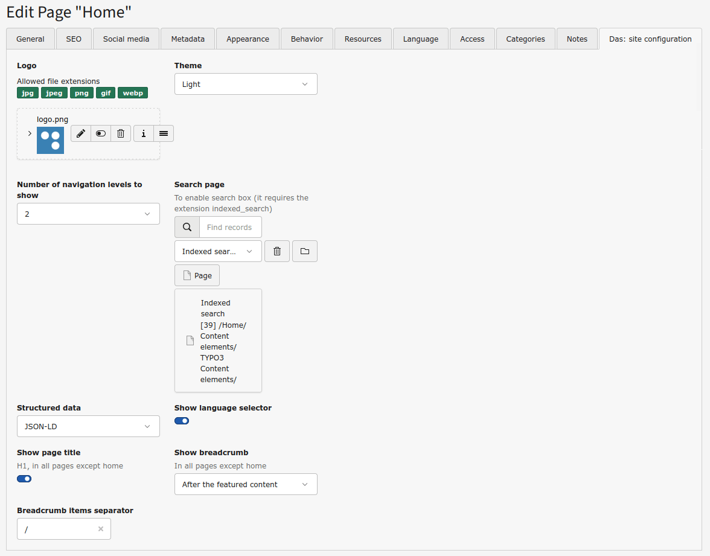
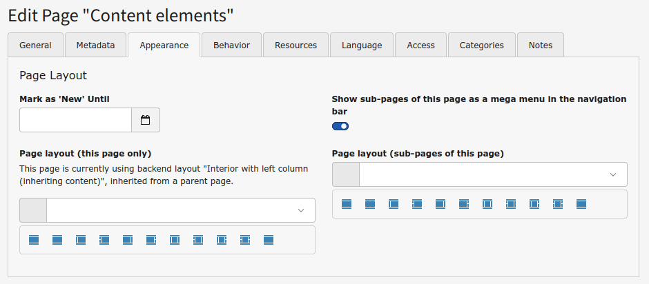

:navigation-title: Quick start

..  _quick-start:

Quick start
===========

Once **Das** has been installed the TYPO3 instance is ready to go, with the page layouts and new content elements available to editors. There is no additional configuration needed, but there are some options to customize the page header that can be easily set in the :guilabel:`Das: site configuration` tab, which only appears in root site pages. It has these fields:

* *Logo*: to set the logo to be shown in the header
* *Theme*: to set the theme to light or dark mode or auto, so the theme applied is the one of the user's device
* *Number of navigation levels to show*: for the header navigation bar, how many (up to two) levels of sub-pages have to be shown
* *Search page*: to show the search box in the header if the extension Indexed search is installed, by setting the page that contains the search results
* *Structured data*: to choose which kind of structured data to use: JSON-LD, Microdata or RDFa
* *Show language selector*: to show, well, the language selector in the header
* *Show breadcrumb:* to enable the breadcrumb, to be shown before or after the Featured content area
* *Breadcrumb items separator*: to set the character to be used as item separator in the breadcrumb

These fields can be disabled via TSConfig if you don't want to give so much freedom to editors.

Additionally, a new field *Show sub-pages of this page as a mega menu in the navigation bar* has been added to the :guilabel:`Appearance` tab of the pages, so pages that are in the first navigation level can have its sub-pages shown in a mega menu in the navigation bar.

