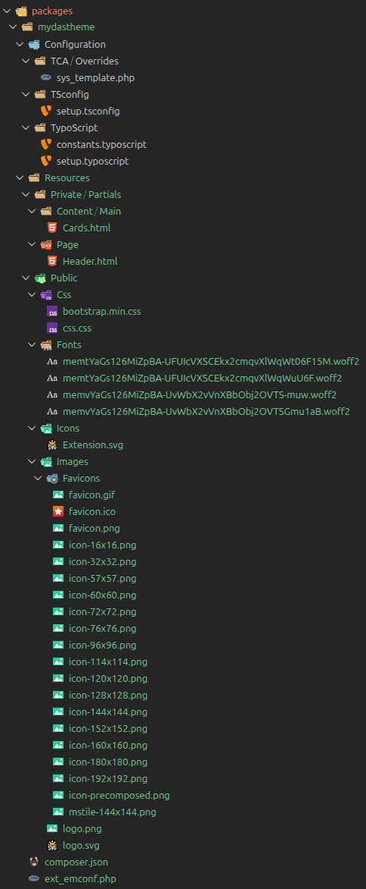

:navigation-title: Themes

..  _themes:

Themes
======

Themes can be built by creating an own extension in which update constants, TSConfig, and partials and add our own assets.

The structure of the folders and files of an extension (for example *mydastheme*) with its own Bootstrap and css files and assets will look something like this:

In the example, the partials *Content/Main/Cards.html* and *Page/Header.html* overwrite the ones from the extension **Das**, so it's possible to have a different frontend outout for the Cards content element and the page header with the navigation bar.

In order to overwrite assets and the path to the partial folders, the files *mydastheme/Configuration/TypoScript/constants.typoscript* and *mydastheme/Configuration/TypoScript/setup.typoscript* should contain something like:

**mydastheme/Configuration/TypoScript/constants.typoscript**

..  code-block:: typoscript

    seo.siteTitle = myDasTheme
    plugin.tx_das {
        settings {
            theme = mydastheme
            cssFile20 = EXT:mydastheme/Resources/Public/Css/bootstrao.min.css
            cssFile95 = EXT:mydastheme/Resources/Public/Css/css.css
        }
        view {
            templates {
                partialRootPath = EXT:mydastheme/Resoources/Private/Partials/Page/
            }
            partialRootPath = EXT:mydastheme/Resoources/Private/Partials/
        }
    }
    page {
        fluidtemplate {
            partialRootPath = EXT:mydastheme/Resoources/Private/Partials/
        }
    }

**mydastheme/Configuration/TypoScript/setup.typoscript**

..  code-block:: typoscript

    page.includeCSS.file95 = {$plugin.tx_das.settings.cssFile95}
